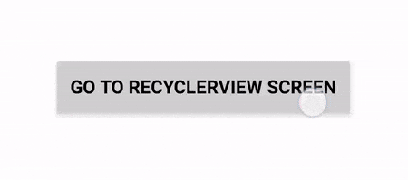
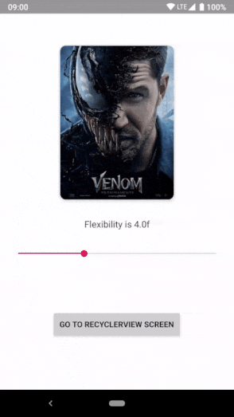
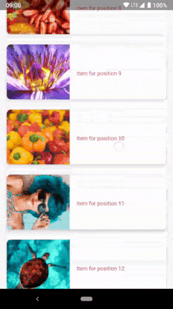

# ElasticView


[](https://android-arsenal.com/api?level=21)
[](https://android-arsenal.com/details/1/7274)

Elastic view is a regular **CardView**, which can **flex** from user touches💪

**Kotlin** ❤️  



Let's see it in action 💻📲





### Download sample [apk](https://github.com/armcha/ElasticView/raw/master/screens/sample.apk) :arrow_down:

The current minSDK version is API level 21.
### Download 

Gradle:
```groovy
implementation 'com.github.armcha:ElasticView:0.1.0'
```

## Setup and usage
You can use it as a regualar CardView.

```xml
 <io.armcha.elasticview.ElasticView
        android:id="@+id/imageElasticView"
        android:layout_width="..."
        android:layout_height="..."
        app:cardCornerRadius="10dp"
        app:cardElevation="5dp">
  
        <ChildView.../>
        <!--or without childView-->
  
</io.armcha.elasticview.ElasticView>
```

## Customization
For now, you can only change flexibility for the view

from code

```kotlin
elasticView.flexibility = 8f
```

or from xml

```xml
 <io.armcha.elasticview.ElasticView
        android:id="@+id/imageElasticView"
        android:layout_width="..."
        android:layout_height="..."
        app:flexibility="7"
        app:cardCornerRadius="10dp"
        app:cardElevation="5dp"/>
```

**Note the flexibility must be between [1f..10f] ❗️**


That's all :ok_hand:

### Contact :book:

:arrow_forward:  **Email**: chatikyana@gmail.com

:arrow_forward:  **Medium**: https://medium.com/@chatikyan

:arrow_forward:  **Twitter**: https://twitter.com/ArmanChatikyan

:arrow_forward:  **Google+**: https://plus.google.com/+ArmanChatikyan

:arrow_forward:  **Website**: https://armcha.github.io/

License
--------

      ElasticView
      Copyright (c) 2018 Arman Chatikyan (https://github.com/armcha/ElasticView).

      Licensed under the Apache License, Version 2.0 (the "License");
      you may not use this file except in compliance with the License.
      You may obtain a copy of the License at

         http://www.apache.org/licenses/LICENSE-2.0

      Unless required by applicable law or agreed to in writing, software
      distributed under the License is distributed on an "AS IS" BASIS,
      WITHOUT WARRANTIES OR CONDITIONS OF ANY KIND, either express or implied.
      See the License for the specific language governing permissions and
      limitations under the License.
